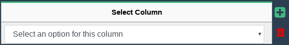
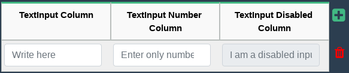

# Vue Dynamic Table

**Vue Dynamic Table** es un plugin para **Vue.js** con el que vas a poder crear tablas customizables y dinámicas para formularios.

#### Características
* Elegir la cantidad de columnas.
* Elegir el tipo de campo que va a tener cada columna.
* Elegir la cantidad de filas.
* Agregar y/o eliminar filas dinámicamente.
* Cambiar el icono de agregar y eliminar fila.
---
## Descarga e instalación de demo

``` bash
# clonar el repositorio
git clone https://github.com/LeonardoVaquel/vue-dynamic-table

# ir al directorio
cd vue-dynamic-table

# instalar dependencias
npm install

# levantar el server con hotreload en localhost:8080
npm run dev
```
---
## Modo de uso

* Importar Vue Dynamic Table
``` javascript
import DynamicTable from '/ubicacion_del_plugin'
```

* Declarar el Componente
``` javascript
components: {
  DynamicTable
},
```

* Usar el tag html ```<DynamicTable>```
``` html
<DynamicTable
  {props}
>
</DynamicTable>
```
---
## Props
* **columns** : Son las columnas de la tabla. Es de tipo Array y es requerido.
``` javascript
columns: {
  type: Array,
  required: true
},
```
* **rows** : Son las filas de la tabla. Es de tipo Array y es requerido.
``` javascript
rows: {
  type: Array,
  required: true
},
```
* **showAddRowButton** : Muestra el botón para agregar una fila. Es de tipo Boolean y no es requerido.
``` javascript
showAddRowButton: {
  type: Boolean,
  required: false,
  default: true
},
```
* **showDeleteRowButton** : Muestra el botón para eliminar una fila. Es de tipo Boolean y no es requerido.
``` javascript
showDeleteRowButton: {
  type: Boolean,
  required: false,
  default: true
},
```
* **iconClassForDeleteButton** : Tipo de icono del botón para eliminar una fila. Es de tipo String y no es requerido. Por default es ```fa fa-trash x2``` de **Font Awesome**.
``` javascript
iconClassForDeleteButton: {
  type: String,
  required: false
},
```
* **iconClassForAddButton** : Tipo de icono del botón para agregar una fila. Es de tipo String y no es requerido. Por default es ```fa fa-plus-square x2``` de **Font Awesome**.
``` javascript
iconClassForAddButton: {
  type: String,
  required: false
},
```
* **data** : Datos para mostrar que vienen de la Base de Datos. Es de tipo Array y no es requerido.
``` javascript
data: {
  type: Array,
  required: false
}
```
---
## Tipos de columnas

### Selector (dropdown menú)
  * **name**: Nombre de la columna. Es de tipo String.
  * **type**: Indica el tipo de la columna. Es de tipo String. Usar ```'select'``` para que la columna sea de tipo Selector.
  * **placeholder**: Placeholder del campo. Es de tipo String. Por default es ```'Select an option'```.
  * **optionsList**: Opciones del campo Selector. Es de tipo Array.

### TextInput
  * **name**: Nombre de la columna. Es de tipo String.
  * **type**: Indica el tipo de la columna. Es de tipo String. Usar ```'textInput'``` para que la columna sea de tipo Input.
  * **placeholder**: Placeholder del campo. Es de tipo String. Por default es ```'Write here...'```.
  * **inputType**: Tipo de input, por default es ```'text'```, se puede cambiar a ```'number'```.
  * **disabled**: Deshabilitar el input. Por default es ```false```, se puede cambiar a ```true```.

### Checkbox (el desarrollo)  

* **name**: Nombre de la columna. Es de tipo String.
* **type**: Indica el tipo de la columna. Es de tipo String. Usar ```'checkbox'``` para que la columna sea de tipo Checkbox.
* **labelTexts**: Labels de cada checkbox. Es de tipo Array.
* **checkboxType**: Tipo del checkbox. Por default es ```'checkbox'```, se puede cambiar a ```'radio'```.

---
## Eventos  

  ### Selector  
  * **selectedOption**: Obtener la opción seleccionada.
  ``` javascript
  {column: "select_column", value: 1}
  ```  


  ### TextInput
  * **textInputValue**: Obtener el valor del input.
  ``` javascript
  {column: "textInput_column", value: "hello"}
  {column: "textInput_number_column", value: "23"}
  ```


  ### Checkbox  
  * **checkboxValue**: Obtener el valor del checkbox.
  ``` javascript
  {column: "checkbox_column", value: true, idxCheck: 0}
  {column: "checkbox_column", value: true, idxCheck: 1}
  {column: "checkbox_column", value: false, idxCheck: 2}
  ```
---
## Ejemplos de usos

* #### Tabla de una columna de tipo Selector.
  
  ``` html
  <DynamicTable
    :columns="this.columnsForTableOne()"
    :rows="this.rowsForTableOne"
    :data="this.dataForTableOne"
    v-on:addRow="addRow()"
    v-on:selectedOption="setSelectedOption($event)"
    v-on:deleteRow="deleteRow($event)">
  </DynamicTable>
  ```
  ``` javascript
  data () {
    return {
      rowsForTableOne: [], // Array de filas.
      objectDataTableOne: { // Objeto que representa a una fila.
        select_column: []
      }
    }
  },
  ```
**¿Cómo declarar una columna de tipo Selector?**  
  * **name**: Nombre de la columna separando las palabras con guiones bajos.  
  * **type** : Tipo de la columna.  
  * **placeholder** : Placeholder del campo.
  * **optionsList** : Opciones del campo.
``` javascript
methods: {
  columnsForTableOne () {
    return [
      {
        name: 'select_column',
        type: 'select',
        placeholder: 'Select an option for this column',
        optionsList: this.optionsListForTable
      }
    ]
  },
}
```  

  **Agregar una fila**  
  ``` javascript
      this.rowsForTableOne.push({
        select_column: null
      })
  ```  
  Al eliminar una fila la tabla ya la elimina automáticamente, si queremos hacer algo más, al momento de eliminarla al escuchar el evento ```deleteRow``` podemos realizar eso que queramos.  
  ``` javascript
  deleteRow (rowIndex) {
    // hacemos lo que queremos. El $event que emite la tabla es el el index de la fila.
  }
  ```  
Para guardar el valor de la opción que se seleccionó escuchamos el evento ```selectedOption```.  
``` javascript
setSelectedOption (option) {
    this.objectDataTableOne[option.column] = option.value
}
```  
* #### Tabla con tres columnas de tipo TextInput
  
``` html
<DynamicTable
    :columns="this.columnsForTableTwo()"
    :rows="this.rowsForTableTwo"
    :data="this.dataForTableTwo"
    v-on:addRow="addRow()"
    v-on:textInputValue="setTextInputValue($event)"
    v-on:deleteRow="deleteRow($event)">
</DynamicTable>
```
``` javascript
data () {
  return {
    rowsForTableTwo: [], // Array de filas
    objectDataTableTwo: { // Objeto que representa una fila
      textInput_column: null,
      textInput_number_column: null,
      textInput_disable_column: null
    }
  }
}
```
**Una Columna de tipo TextInput se declara como un Objecto con las siguientes propiedades:**
